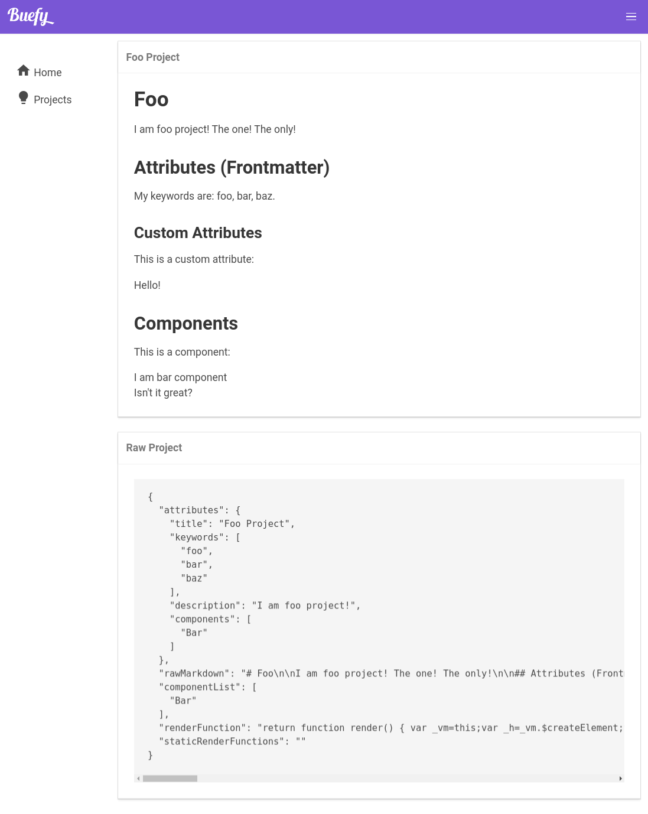

# nuxt-dynamic-markdown

> Markdown + frontmatter -> dynamically generated vuex stores + more.

## Table of Contents

- [Disclaimer](#disclaimer)
- [Rationale / Origin](#rationale--origin)
  - [Evolution](#evolution)
- **[What is it?](#what-is-it)**
- **[What does it look like?](#what-does-it-look-like)**
  - **[Example project](#example-project)**
- **[How do I install it?](#how-do-i-install-it)**
  1. [Create nuxt project](#create-nuxt-project)
  2. [Install the module](#install-the-module)
  3. [Register the module](#register-the-module)
- **[Walkthrough / guide](#walkthrough--guide)**
  - [Directory structure](#directory-structure)
  - [Defining entities](#defining-entities)
    - [YAML front matter](#yaml-front-matter)
    - [Registering components](#registering-components)
    - [Markdown content](#markdown-content)
  - [Creating pages](#creating-pages)
    - [The view project page](#the-view-project-page)
      - [Accessing the entity](#accessing-the-entity)
      - [Passing custom attributes](#passing-custom-attributes)
      - [Mixins and helpers (entity)](#mixins-and-helpers-entity)
      - [A note on boilerplate](#a-note-on-boilerplate)
    - [The project listing page](#the-project-listing-page)
      - [Mixins and helpers (index)](#mixins-and-helpers-index)
    - [Creating the component](#creating-the-bar-component)
  - [Result](#result)
    - [Notes](#notes-result)

---

## Disclaimer

This project is **pre-alpha** and you should 100% not use it in a production environment!

- Some parts of the code don't have proper error checking.
- **There are no tests**. Zero. Nada. Keine. Zilch.
- I haven't tried running any of this in other browsers; on other OSes; with different versions of Nuxt, Vue etc. nor can I guarantee that it works in parallel dimensions, different universes or alternate timelines.
- It currently relies on `fs.promises` (experimental API, requires `node > 8` I believe).
- This README presumes a decent understanding of both Nuxt and Vue.
- Just because the README mentions a feature, that doesn't mean that said feature is ready, or that it has even been started, or that it will ever come, or that it's possible, or that you'd like it if any of those things were true.
- While there is a basic guide/walkthrough there is no actual documentation (API or otherwise) at this early stage.
- I'm really new to Nuxt and I'm learning as I go so this may well be the worst Nuxt module of all time!

Finally, you should check out [NuxtPress](https://github.com/nuxt/press) because it does kind of a similar-ish (but not really) thing but probably in a far far better way.

_[Back to top](#nuxt-dynamic-markdown)_

---

## Rationale / Origin

I chose to use Nuxt for my personal site and at some point decided that I wanted some kind of custom blog system.

It needed to allow one to:

- "define" a category by creating a directory
- create a post by creating a markdown file
- be able to add things like tags etc. to YAML frontmatter
- a way to use arbitrary components within my posts
- and so on...

So I worked on that for a little while and got it to a stage where I was vaguely happy with it (at least functionality-wise, as a proof of concept or early prototype).

### Evolution

At some point, I thought to myself - wouldn't it be cool if I could use a similar system for the projects section of my site.

So I created a branch on my website repository and started playing with that idea. Then I figured, what the heck - why not just try to make it into a module/plugin? And here we are.

_[Back to top](#nuxt-dynamic-markdown)_

---

## What is it?

It basically takes directories that contain markdown files that contain YAML front matter and builds "entities" and the relationships (e.g. `hasMany`) between them.

All of this gets dumped into JSON which in turn is pulled into Vuex. Also, getters/setters are dynamically generated for us to help us with our relationships (please note that it doesn't help you with your real life relationships).

Finally, the **DynamicMarkdown** component helps us to quickly/easily render our strange Frankensteinesque creation.

If that didn't make any sense then try the [walkthrough](#walkthrough)!

_[Back to top](#nuxt-dynamic-markdown)_

---

## What does it look like?

You can check out the [live demo](https://serene-chandrasekhar-209033.netlify.com/projects/) if you're so inclined.

### Example project

The live demo is simply [this example project](https://www.github.com/sustained/nuxt-dynamic-markdown-example-project) deployed to Netlify.

---

## How do I install it?

### Create nuxt project

If you don't already have a nuxt project then create one:

> **IMPORTANT:** Make sure to enable Vuex when prompted.

```sh
npx create-nuxt-app my-project
```

### Install the module

With either npm or yarn:

```sh
npm install --save nuxt-dynamic-markdown
# or
yarn add nuxt-dynamic-markdown
```

### Register the module

In `nuxt.config.js`:

```js
import NuxtDynamicMarkdown from "nuxt-dynamic-markdown";

export default {
  modules: [
    [
      NuxtDynamicMarkdown,
      {
        /*
          Sources are how you tell NDM what to load, 
          where from and how you define your relationships.
          
          IMPORTANT: This data-source is presumed to be 
          present for the duration of this README.
        */
        sources: [
          {
            nested: false,
            name: "projects",
            directory: "projects",
            relationships: ["keywords"]
          }
        ]
      }
    ]
  ]
};
```

Installation complete. Well done, you made it this far!

_[Back to top](#nuxt-dynamic-markdown)_

---

## Walkthrough / guide

### Directory structure

Okay. Presume we have a directory called `contents` in our Nuxt project with the following structure:

```
contents/
  projects/
    my-first-project/
      content.md
```

### Defining entities

And the following `content.md` file:

```markdown
---
title: Foo Project
keywords: [foo, bar, baz]
description: I am foo project!
components: [Bar]
---

# Foo

I am foo project! The one! The only!

## Attributes (frontmatter)

My keywords are: {{ keywords.join(", ") }}.

### Custom attributes

This is a custom attribute:

{{ custom }}

## Components

This is a component:

<Bar />

Isn't it great?
```

There's a lot going on there so let's break it down:

#### YAML front matter

- You can attach arbitrary data to an entity using the YFM block.
- All attributes can be accessed within the markdown.
- You can pass custom (non-YFM) attributes.
- By convention, `keywords` and `description` populate `<meta>`.

> **NOTE:** Currently you must mix in the `getMeta` and `setHead` mixins in order for `<meta>` to be populated.

#### Registering components

The special attribute `components` allows you to make components available within the markdown file.

#### Markdown content

The markdown can be anything you want, there are no real restrictions.

_[Back to top](#nuxt-dynamic-markdown)_

---

### Creating pages

#### The view project page

Next, we'll create a `projects` folder in `pages` and within it we'll create two files.

The first file will be called `_project.vue` and will display an individual project:

```html
<template>
  <section>
    <DynamicMarkdown
      v-bind="project"
      :custom-attributes="{ custom: 'Hello!' }"
    />
  </section>
</template>

<script>
  import { getMeta, setHead, asyncData } from "nuxt-dynamic-markdown/lib/mixin";

  export default {
    mixins: [getMeta, setHead],
    asyncData
  };
</script>
```

##### Accessing the entity

Since the route parameter for a Nuxt page called `_project.vue` is `project` then the entity will be available via `this.project`.

So we simply pass this in to the `DynamicMarkdown.vue` component, which renders it for us.

> **NOTE:** It's important that you pass it in exactly as above - `v-bind="entity"`.

##### Passing custom attributes

As you can see, this is also where we pass in the custom attributes mentioned earlier.

##### Mixins and helpers (entity)

For now it is **required** that you, at a minimum, import the `asyncData` helper and pass it to your component.

The `getMeta` and `setHead` mixins on the other hand are *not required* to be used.

##### A note on boilerplate

Ideally none of this boilerplate would be necessary but for the time being it is, unfortunately.

I intend to look into ways to reduce and/or remove it.

#### The project listing page

The second file will be called `index.vue` and will list all projects:

```html
<template>
  <section>
    <h1>My Projects</h1>

    <ul>
      <li v-for="project in projects">
        <nuxt-link
          :to="{
            name: 'projects-project',
            params: { project: projectName }
          }"
        >
          {{ project }}
        </nuxt-link>
      </li>
    </ul>
  </section>
</template>

<script>
  import { getEntities } from "nuxt-dynamic-markdown/lib/mixin";

  export default {
    asyncData: getEntities("projects")
  };
</script>
```

##### Mixins and helpers (index)

For this case (index/listing pages), it is **not required** that you use the `getEntities` helper.

If you wanted to, you could just as well create a computed property that simply accesses the Vuex store - it's roughly the same amount of code, to be honest.

_[Back to top](#nuxt-dynamic-markdown)_

---

### Creating the `Bar` component

Finally we'll create a file called `Bar.vue` in `components` since we referenced it in our `content.md` file earlier.

```html
<template>
  <div>
    <p>I am bar component.</p>
  </div>
</template>
```

_[Back to top](#nuxt-dynamic-markdown)_

---

### Result

If the stars were aligned properly and you uttered the incantations with the correct stress and prosody then you should see something like this:




> **NOTE:** You may see something slightly more simple-looking presuming you didn't use our [example project](https://www.github.com/sustained/nuxt-dynamic-markdown-example-project) (which uses Bulma).

_[Back to top](#nuxt-dynamic-markdown)_

---
